<!-- Generated by `qits database diagram` (jpa). Do not edit: the entity-diagram automation rewrites this file on every release request fold. -->
# Persistence unit `epics`

Datasource `epics` · packages `eu.wohlben.qits.entities.entity`, `eu.wohlben.qits.entities.campaign` · 10 entities

```mermaid
erDiagram
  %% AuditEntry: eu.wohlben.qits.entities.entity.AuditEntry (entities)
  AuditEntry {
    string id PK "not null"
    uuid causation_id
    instant changed_at "not null"
    string changed_by
    string entity_id "not null"
    enum entity_type "not null"
    string epic_id "not null"
    enum operation "not null"
    string snapshot
  }
  %% campaign_criterion: eu.wohlben.qits.entities.campaign.CampaignCriterion (entities)
  campaign_criterion {
    string id PK "not null"
    string approval_note
    string approved_by
    uuid causation_id
    instant created_at "not null"
    uuid evidence_event_id
    string evidence_signature "length 128"
    string evidence_summary
    string group_id "not null"
    enum kind "not null"
    int position "not null"
    string predicate "not null"
    instant satisfied_at
    boolean seeded "not null"
  }
  %% campaign_criterion_group: eu.wohlben.qits.entities.campaign.CampaignCriterionGroup (entities)
  campaign_criterion_group {
    string id PK "not null"
    uuid causation_id
    instant created_at "not null"
    string membership_id "not null"
    int position "not null"
  }
  %% campaign_start: eu.wohlben.qits.entities.campaign.CampaignStartRecord (entities)
  campaign_start {
    string campaign_id PK "not null"
    boolean active "not null"
    uuid causation_id
    instant first_started_at "not null"
    instant started_at "not null"
    string started_by "not null"
  }
  %% dossier_asset: eu.wohlben.qits.entities.entity.DossierAsset (entities)
  dossier_asset {
    string id PK "not null"
    bytes bytes "not null"
    uuid causation_id
    instant created_at "not null"
    string epic_id "not null"
    enum kind "not null"
    string label "not null"
    string mime_type "not null"
  }
  %% dossier_page: eu.wohlben.qits.entities.entity.DossierPage (entities)
  dossier_page {
    string id PK "not null"
    text body "not null"
    uuid causation_id
    instant created_at "not null"
    string epic_id
    int position "not null"
    string slug "not null"
    string ticket_id
    string title "not null"
    instant updated_at "not null"
    long version "not null"
  }
  %% dossier_page_asset: eu.wohlben.qits.entities.entity.DossierPageAsset (entities)
  dossier_page_asset {
    string asset_id PK "not null"
    string page_id PK "not null"
  }
  %% entity: eu.wohlben.qits.entities.entity.WorkEntity (entities)
  entity {
    string id PK "not null"
    enum archetype "not null"
    string assignee
    boolean blocked "not null"
    uuid causation_id
    instant created_at "not null"
    string created_by
    string depends_on_entity_id
    string description
    boolean dispatch_continues "not null"
    string impetus
    instant implemented_at
    instant implementing_at
    long number "not null"
    string pre_approved_by
    string project_id "not null"
    string repository_id
    string slug "not null"
    string slug_scope "not null"
    string status "length 32"
    string superseded_by_entity_id
    enum ticket_type
    string title "not null"
    instant updated_at "not null"
  }
  %% entity_acceptance_criterion: eu.wohlben.qits.entities.entity.WorkEntity.acceptanceCriteria (entities)
  entity_acceptance_criterion {
    string entity_id PK, FK "not null"
    int position PK "not null"
    string text "not null"
  }
  %% entity_comment: eu.wohlben.qits.entities.entity.EntityComment (entities)
  entity_comment {
    string id PK "not null"
    string author
    string body "not null"
    uuid causation_id
    instant created_at "not null"
    string entity_id "not null"
    instant updated_at "not null"
  }
  %% entity_membership: eu.wohlben.qits.entities.entity.EntityMembership (entities)
  entity_membership {
    string id PK "not null"
    uuid causation_id
    string child_id "not null"
    instant claimed_at
    instant created_at "not null"
    string dispatch_agent_launch "length 32"
    string dispatch_branch
    string dispatch_error
    string dispatch_refusal
    instant dispatch_refused_at
    string dispatch_workspace_id
    instant dispatched_at
    boolean joined_running "not null"
    enum kind "not null"
    string parent_id "not null"
    int position "not null"
    instant updated_at "not null"
  }
  entity_acceptance_criterion }o--|| entity : "entity_id"
```

