<!-- Generated by `qits database diagram` (jpa). Do not edit: the entity-diagram automation rewrites this file on every release request fold. -->
# Persistence unit `projects`

Datasource `projects` · package `eu.wohlben.qits.projects.entity` · 22 entities

```mermaid
erDiagram
  %% Project: eu.wohlben.qits.projects.entity.Project (domain)
  Project {
    string id PK "not null"
    instant announced_at
    uuid causation_id
    string description
    string dns_domain
    enum dns_type
    string dns_value
    enum front_desk_lifecycle "not null"
    string name "not null"
    string slug
    boolean supports_environments "not null"
  }
  %% Repository: eu.wohlben.qits.projects.entity.Repository (domain)
  Repository {
    string id PK "not null"
    enum archetype
    uuid causation_id
    string component
    string config_warning "length 4000"
    instant last_backup_at
    string last_backup_detail "length 1000"
    enum last_backup_outcome
    string main_branch
    string project_id FK "not null"
    string url
  }
  %% agent_harness_capability: eu.wohlben.qits.projects.entity.AgentHarnessCapability (domain)
  agent_harness_capability {
    string id PK "not null"
    text auth_detail "not null"
    boolean authenticated "not null"
    uuid causation_id
    text effort_levels "not null"
    boolean effort_supported "not null"
    string harness "not null"
    text harness_version "not null"
    text image_version "not null"
    text models "not null"
    boolean models_enumerated "not null"
    text probe_detail "not null"
    boolean probe_failed "not null"
    instant reported_at "not null"
    text reported_by "not null"
  }
  %% agent_mcp_catalog_entry: eu.wohlben.qits.projects.entity.AgentMcpCatalogEntry (domain)
  agent_mcp_catalog_entry {
    string catalog_key PK "not null"
    text allowed_tools "not null"
    uuid causation_id
    instant created_at "not null"
    text credential_key "not null"
    text display_name "not null"
    text header_name "not null"
    instant updated_at "not null"
    string updated_by
    text url "not null"
  }
  %% agent_surface_configuration: eu.wohlben.qits.projects.entity.AgentSurfaceConfiguration (domain)
  agent_surface_configuration {
    string surface_key PK "not null"
    boolean activity_tracking "not null"
    uuid causation_id
    instant created_at "not null"
    text effort "not null"
    enum harness "not null"
    text initial_prompt "not null"
    text model "not null"
    enum permission_mode "not null"
    boolean remote_control "not null"
    text system_prompt "not null"
    instant updated_at "not null"
    string updated_by
  }
  %% agent_surface_configuration_revision: eu.wohlben.qits.projects.entity.AgentSurfaceConfigurationRevision (domain)
  agent_surface_configuration_revision {
    string id PK "not null"
    uuid causation_id
    instant changed_at "not null"
    string changed_by
    text snapshot "not null"
    string surface_key "not null"
  }
  %% agent_surface_external_mcp_attachment: eu.wohlben.qits.projects.entity.AgentSurfaceExternalMcpAttachment (domain)
  agent_surface_external_mcp_attachment {
    string id PK "not null"
    string catalog_key "not null"
    uuid causation_id
    int position "not null"
    string surface_key "not null"
  }
  %% agent_surface_mcp_attachment: eu.wohlben.qits.projects.entity.AgentSurfaceMcpAttachment (domain)
  agent_surface_mcp_attachment {
    string id PK "not null"
    text allowed_tools "not null"
    uuid causation_id
    boolean narrow_project "not null"
    boolean narrow_repository "not null"
    boolean narrow_workspace "not null"
    int position "not null"
    boolean read_only "not null"
    string server_key "not null"
    string surface_key "not null"
  }
  %% commit_build_status: eu.wohlben.qits.projects.entity.CommitBuildStatus (domain)
  commit_build_status {
    string run_id PK "not null"
    string branch
    uuid causation_id
    string commit_sha "not null"
    instant finished_at "not null"
    string project_id
    string repo_id "not null"
    string repo_name
    string retry_of_run_id
    string status "not null"
  }
  %% desk_runner: eu.wohlben.qits.projects.entity.DeskRunner (domain)
  desk_runner {
    uuid id PK "not null"
    jsonb capabilities
    uuid causation_id
    string client_id
    instant created_at "not null"
    string description
    instant last_health_check_at
    boolean last_health_check_ok
    instant last_seen_at
    string login_state
    string name "not null"
    string quarantine_reason
    instant quarantined_at
    instant registered_at
    string registration_token_id
    string registration_token_subject
    int slots "not null"
  }
  %% front_desk: eu.wohlben.qits.projects.entity.FrontDesk (domain)
  front_desk {
    string project_id PK "not null"
    instant created_at "not null"
    enum desired "not null"
    string failure_detail
    instant last_demand_at
    instant placed_at
    instant queued_at
    instant reported_at
    string reported_spec_hash
    string reported_state
    uuid runner_id
    string spec_hash
    jsonb spec_json
    string token_id
    string token_subject
    string token_value
  }
  %% refinement: eu.wohlben.qits.projects.entity.Refinement (domain)
  refinement {
    long id PK "not null, generated"
    string branch "not null"
    uuid causation_id
    text commissioned_client_id
    text commissioned_client_secret
    instant created_at "not null"
    string entity_id UK "not null"
    string label "not null"
    string parent "not null"
    string project_id "not null"
    string repository_id "not null"
  }
  %% refinement_design: eu.wohlben.qits.projects.entity.RefinementDesign (domain)
  refinement_design {
    string id PK "not null"
    uuid causation_id
    instant created_at "not null"
    string created_by "not null"
    text html "not null"
    int html_bytes "not null"
    long refinement_id_fk "not null"
    string source_route
    string title "not null"
    boolean truncated "not null"
    instant updated_at "not null"
    long version "not null"
  }
  %% refinement_prompt_attachment: eu.wohlben.qits.projects.entity.RefinementPromptAttachment (domain)
  refinement_prompt_attachment {
    string id PK "not null"
    bytea bytes "not null"
    instant created_at "not null"
    string label "not null"
    string mime_type "not null"
    long refinement_id_fk "not null"
    enum source "not null"
  }
  %% refinement_prompt_draft: eu.wohlben.qits.projects.entity.RefinementPromptDraft (domain)
  refinement_prompt_draft {
    long refinement_id_fk PK "not null"
    text content "not null"
    instant last_run_at
    string last_run_command_id
    long last_run_prompt_version
    long prompt_version "not null"
    text serialized_prompt
    instant updated_at "not null"
  }
  %% release_pipeline_run: eu.wohlben.qits.projects.entity.ReleasePipelineRun (domain)
  release_pipeline_run {
    string run_id PK "not null"
    uuid causation_id
    string commit_sha
    instant finished_at
    string phase "not null"
    string release_request_id "not null"
    string repo_id "not null"
    instant started_at
    string status "not null"
    instant updated_at "not null"
  }
  %% release_request: eu.wohlben.qits.projects.entity.ReleaseRequest (domain)
  release_request {
    string id PK "not null"
    instant armed_at "not null"
    uuid causation_id
    string conflict_detail
    instant created_at "not null"
    string detail
    instant gate_ticket_closed_at
    string gate_ticket_id
    string merged_sha
    string project_id
    string qa_announced_sha
    string rejecting_run_id
    string repo_id "not null"
    string repo_name
    string requester
    boolean retryable "not null"
    enum state "not null"
    string summary "not null"
    string superseded_by
    instant updated_at "not null"
    string version
  }
  %% release_request_approval: eu.wohlben.qits.projects.entity.ReleaseRequestApproval (domain)
  release_request_approval {
    string id PK "not null"
    string actor "not null"
    uuid causation_id
    instant decided_at "not null"
    enum decision "not null"
    string merged_sha "not null"
    string note
    string request_id "not null"
  }
  %% release_request_automation_waiver: eu.wohlben.qits.projects.entity.ReleaseRequestAutomationWaiver (domain)
  release_request_automation_waiver {
    string id PK "not null"
    string actor "not null"
    uuid causation_id
    string merged_sha "not null"
    string reason "not null"
    string request_id "not null"
    instant waived_at "not null"
  }
  %% release_request_source: eu.wohlben.qits.projects.entity.ReleaseRequestSource (domain)
  release_request_source {
    string id PK "not null"
    instant added_at "not null"
    string added_by
    uuid causation_id
    enum kind "not null"
    string name "not null, length 512"
    enum priority "not null"
    string request_id "not null"
  }
  %% released_tag_pending_merge: eu.wohlben.qits.projects.entity.ReleasedTagPendingMerge (domain)
  released_tag_pending_merge {
    string id PK "not null"
    instant abandoned_at
    instant deployment_active_at
    string merge_detail "length 4000"
    instant merge_requested_at
    instant merged_at
    string publish_detail "length 4000"
    string publish_run_id
    enum publish_state
    string release_request_id
    instant released_at "not null"
    string released_sha "not null"
    string repo_id "not null"
    string tag_name "not null"
  }
  %% repository_name: eu.wohlben.qits.projects.entity.RepositoryName (domain)
  repository_name {
    string id PK "not null, generated"
    string name UK "not null"
    string project_id FK, UK "not null"
    string repository_id FK "not null"
  }
  Repository }o--|| Project : "project_id"
  repository_name }o--|| Project : "project_id"
  repository_name }o--|| Repository : "repository_id"
```

